# Getting started with a Development Container for Terraform On Azure

_This post is about to explain, how to use a dev container, if you’d like to work with Terraform on Azure_

## 1\. Introduction

Imagine, you would like to provision resources in Azure using Terraform, but you don’t have the tools, respectively the prerequisites installed on your local machine? A dev container, including all the mandatory stuff could help for that purpose.

In this post I’d like to show you how I’m using my dev container to:

- apply _Azure_ CLI commands (login, updating a _kubeconfig_ file)
- use _vim_ for editing files
- use _git_ for cloning a repository from _GitHub_
- apply _Terraform_ commands for provisioning an _Azure_ _Kubernetes_ Service
- apply _kubectl_ commands

## 2\. Prerequisites

As prerequisites you’ll need:

- a Container Runtime Environment like _Docker_: [https://www.docker.com/products/docker-desktop/](https://www.docker.com/products/docker-desktop/)
- Visual Studio Code: [https://code.visualstudio.com/](https://code.visualstudio.com/)
- Docker Extension for Visual Studio Code: [https://marketplace.visualstudio.com/items?itemName=ms-azuretools.vscode-docker](https://marketplace.visualstudio.com/items?itemName=ms-azuretools.vscode-docker))

## 3\. Get Dockerfile and Build the Dev Container

I’ve created a Container, which is based on Ubuntu 22.04 and which has following tools installed:

- curl
- terraform
- vim
- git
- azure cli
- kubectl

Click at following link below, which leads to my GitHub repository:

[GitHub - andbron - devcontainer](https://github.com/andbron/dev-container-terraform-azure)

and clone it on your local machine:

```
git clone https://github.com/andbron/dev-container-terraform-azure.git

```

Afterwards, start a terminal of your choice, change the directory to “terraformonazure” and build the container:

```
docker build -t devcon-terraformonazure:1.0 .

```

After that, you should get a Container Image, named “devcon-terraformonazure” with the tag “1.0”. Prove that by running:

## 4\. Usage of the Dev Container

In this section, I’d like to show how to use following tools:

- **terraform**: by provisioning an _Azure_ Kubernetes Cluster
- **vim**: by editing a _Terraform_ configuration file
- **git**: by cloning a repository from GitHub, which includes a _Terraform_ configuration file
- **azure cli**: by login to _Azure_ and to update the _kubeconfig_ file
- **kubectl**: by showing the contexts and by listening all pods of the _kube-system_ namespace

### 4.1 Start the Container with Visual Studio Code

As first step, start Visual Studio Code:

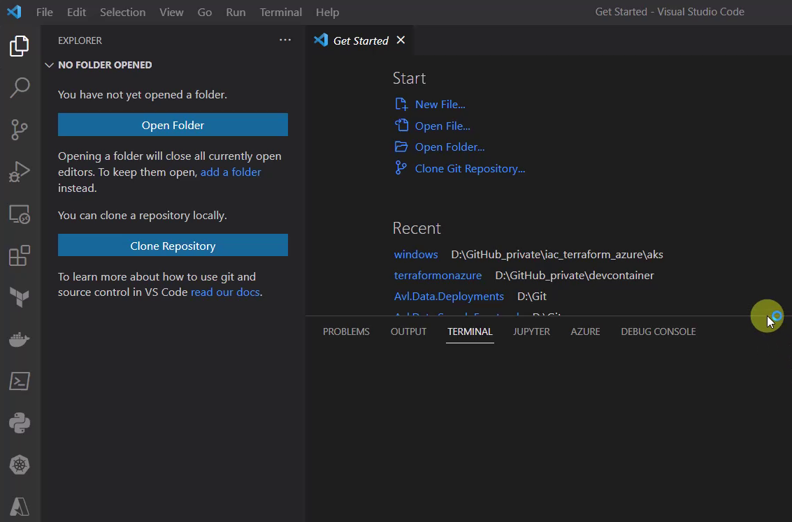

Select the “Docker” icon on the left and scroll to the “devcon-terraformonazure” image. Right click at the tag and choose “Run Interactive”:

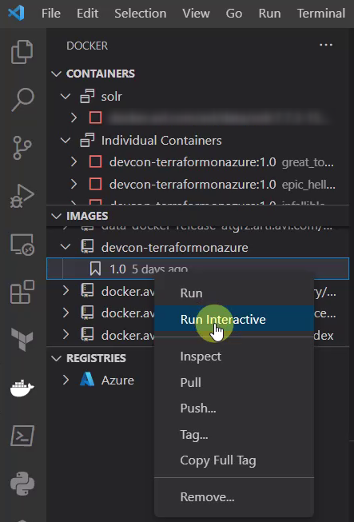

A new terminal occurs, showing the run command for the Container:

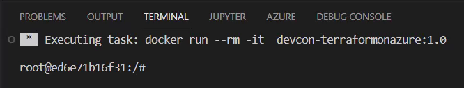

As next, go to “Containers”, there the running instance should be listed. Right click on the running instance and choose “Attach Visual Studio Code”:

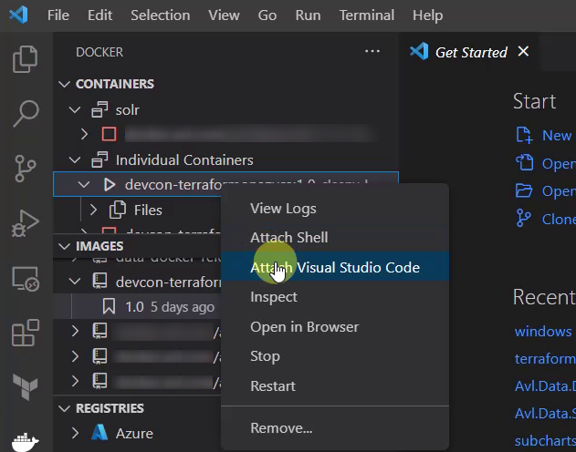

A new Visual Studio Code instance will be started:

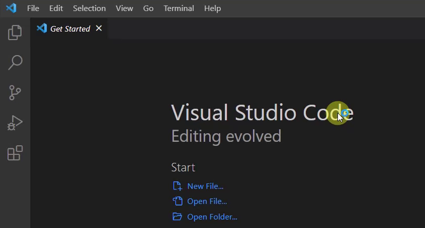

You should be capable to prove that you’re now connected to the Container:

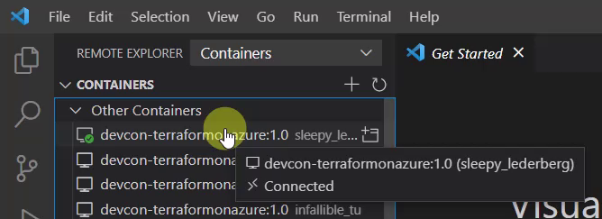

You can list the content of the current directory of the Container - this should be similar as seen in the picture below:

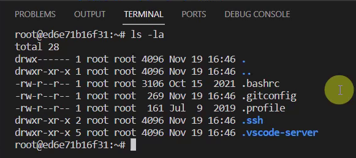

Now the Container is ready, let’s do some actions with the mentioned tools.

### 4.2 Azure CLI - Login to your Azure Subscription

Prove that the _Azure_ CLI is installed by simply typing “az” in the Terminal:

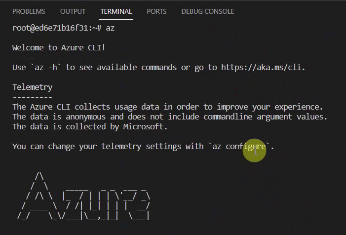

Let’s establish the connection to an _Azure_ subscription. For that, I’d like to use the “azure login” command. Therefore, type:

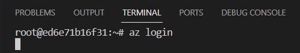

Confirming the command by pressing enter opens your browser. Select your dedicated account, which you’d like to use:


After picking you account, you should see logs similar as seen in the picture below:

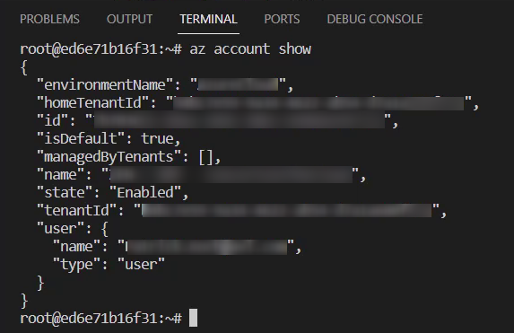

### 4.3 Git - Clone a GitHub Repository

After conducting the login to the _Azure_ subscription, I’ll need some code to work with. For that, I’m going to clone a _GitHub_ repository.

For instance, I’ll go to [https://github.com/andbron/dev-container-terraform-azure](https://github.com/andbron/dev-container-terraform-azure) - copy the web url for the _git clone_ command:

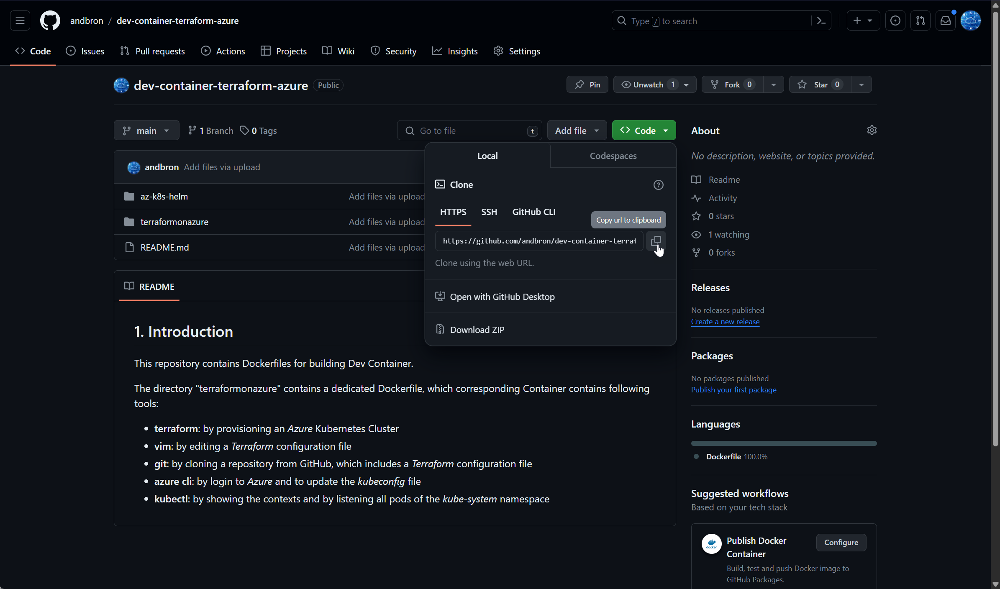

Switch back to Visual Studio Code and clone the repository by pasting the command in the Terminal:

```
git clone https://github.com/andbron/dev-container-terraform-azure.git

```

Conducting that command should clone the whole repository in the dev container. The directory “iac_terraform_azure” will be available in the file system:

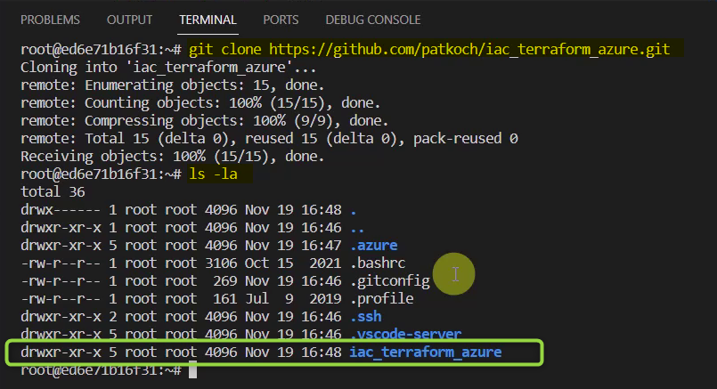

Change the directory to “/iac_terraform_azure/aks/windows” - the _Terraform_ configuration “aks.tf” can be seen inside that directory:

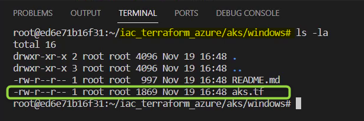

### 4.4 Vim - Adapt the Terraform configuration file by using Vim

Imagine you’d need to quickly adapt some files in your dev container to find the proper settings. _Vim_ would be a good choice for that.

Type “vim aks.tf” in the Terminal and confirm it by pressing enter:

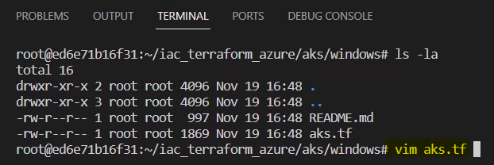

This will open the _Terraform_ configuration. I’d like to rename the cluster to “patricks-new-aks”. Leave _Vim_ by typing _:wq!_ and by pressing enter when you’re done with your changes:

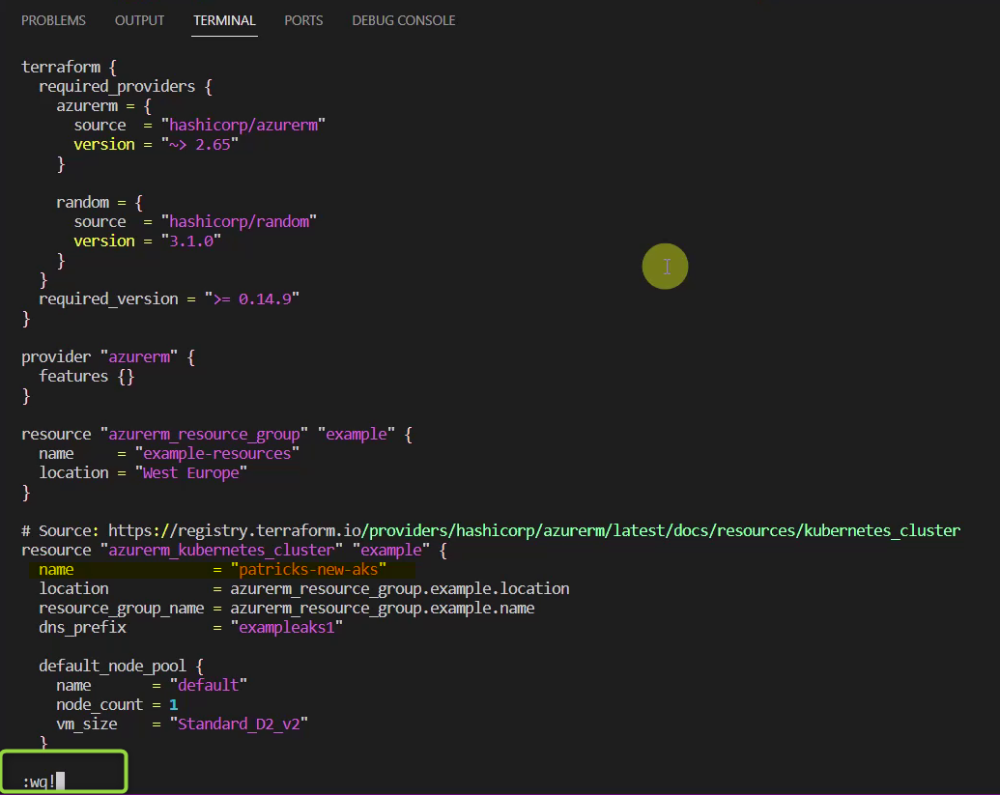

### 4.5 Terraform - Provision an Azure Kubernetes Service

After starting the dev container, establishing the connection to the _Azure_ subscription, cloning a repo from _GitHub_ and adapting the _Terraform_ file…it’s time to provision a resource in _Azure_. For that, I’m going to use _Terraform_.

I’ll conduct the commands:

- init
- validate
- apply

for creating an _Azure_ Kubernetes Service.

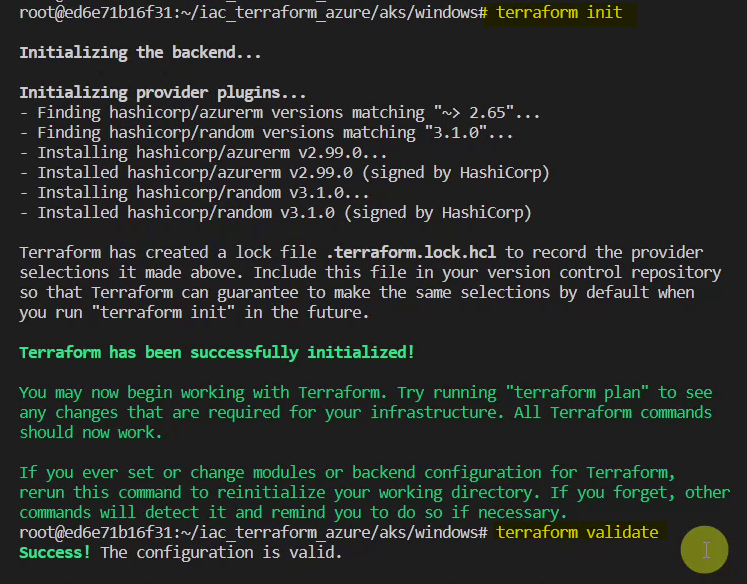

Confirm the creation of the cluster by entering “yes”:

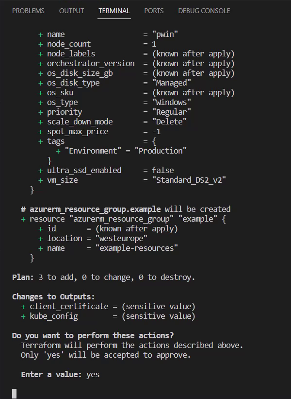

This leads to an _Azure_ Kubernetes Service named “patricks-new-aks”:

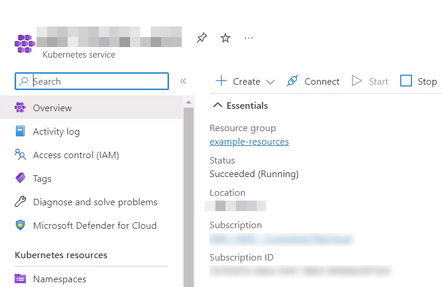

### 4.6 kubectl - Apply basic kubectl commands

Finally, the usage of _kubectl_ is missing. Before applying commands using _kubectl_, I need to update my _kubeconfig_ file, as the _Azure_ Kubernetes Service is newly created and unknown to the _kubeconfig_ file.

Therefore, I’ll update the _kubeconfig_ file by running following _Azure_ CLI command:

```
az aks get-credentials --name patricks-new-aks -g example-resources

```

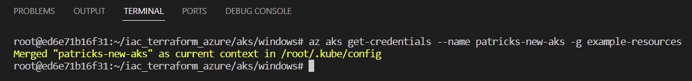

Now it is possible to use _kubectl_. Imagine I’d like to list all available contexts - for that I’ll conduct:

```
kubectl config get-contexts

```

This returns the current cluster:

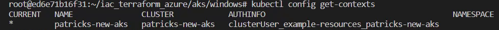

As next, I’d like to get all pods of the “kube-system” namespace. I’ll run following command:

```
kubectl get pods -n kube-system

```

This should lead to following result:

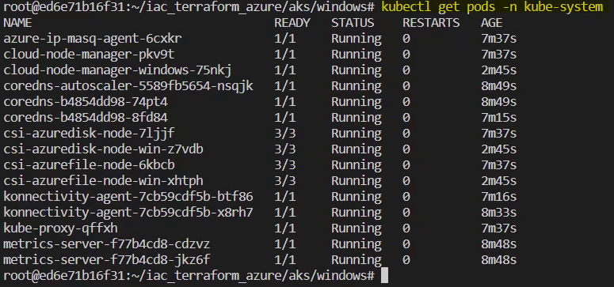

### 4.7 Clean Up and Closing the Dev Container

If there is no need for the _Azure_ Kubernetes Service any more, let’s destroy it by running the proper _Terraform_ command:

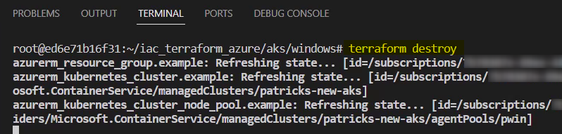

Finally, let’s stop the dev container by selecting “Stop Container” in Visual Studio Code.

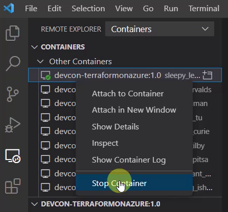

## Conclusion

I’d be glad if this dev container would be useful for someone - I really love to work with dev containers, which enables to quickly switch between different environment for development.

## References

[Azure CLI - learn.microsoft.com](https://learn.microsoft.com/en-us/cli/azure/)

[vim - vim.org](https://www.vim.org/)

[Hashicorp - terraform.io](https://www.terraform.io/)

[Kubernetes.io - install-kubectl-linux](https://kubernetes.io/docs/tasks/tools/install-kubectl-linux/)

[Git - git-scm.com](https://git-scm.com/downloads)

[Docker - docker.com/products/docker-desktop](https://www.docker.com/products/docker-desktop/)

[Visual Studio Code - code.visualstudio.com/](https://code.visualstudio.com/)

[Marketplace Visual Studio - ms-azuretools](https://marketplace.visualstudio.com/items?itemName=ms-azuretools.vscode-docker)
