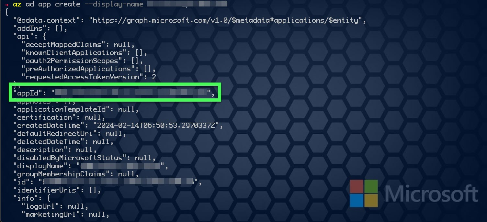
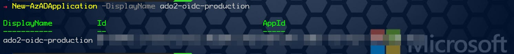
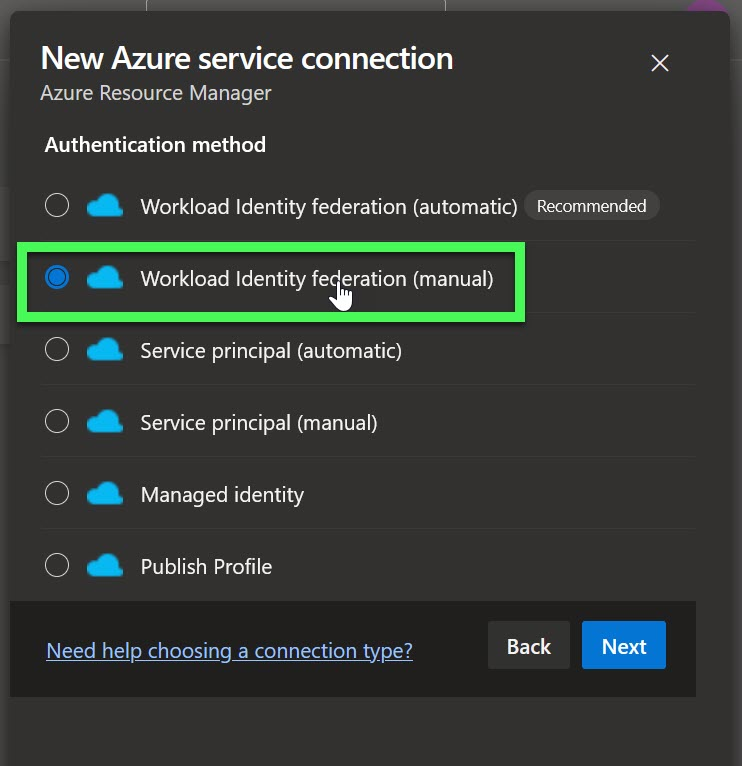
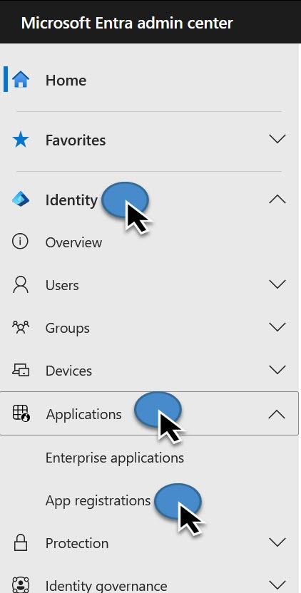
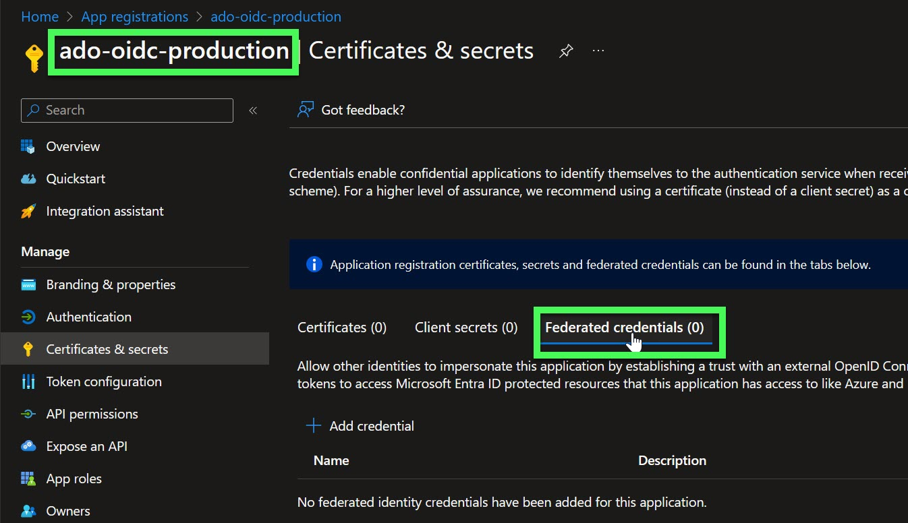
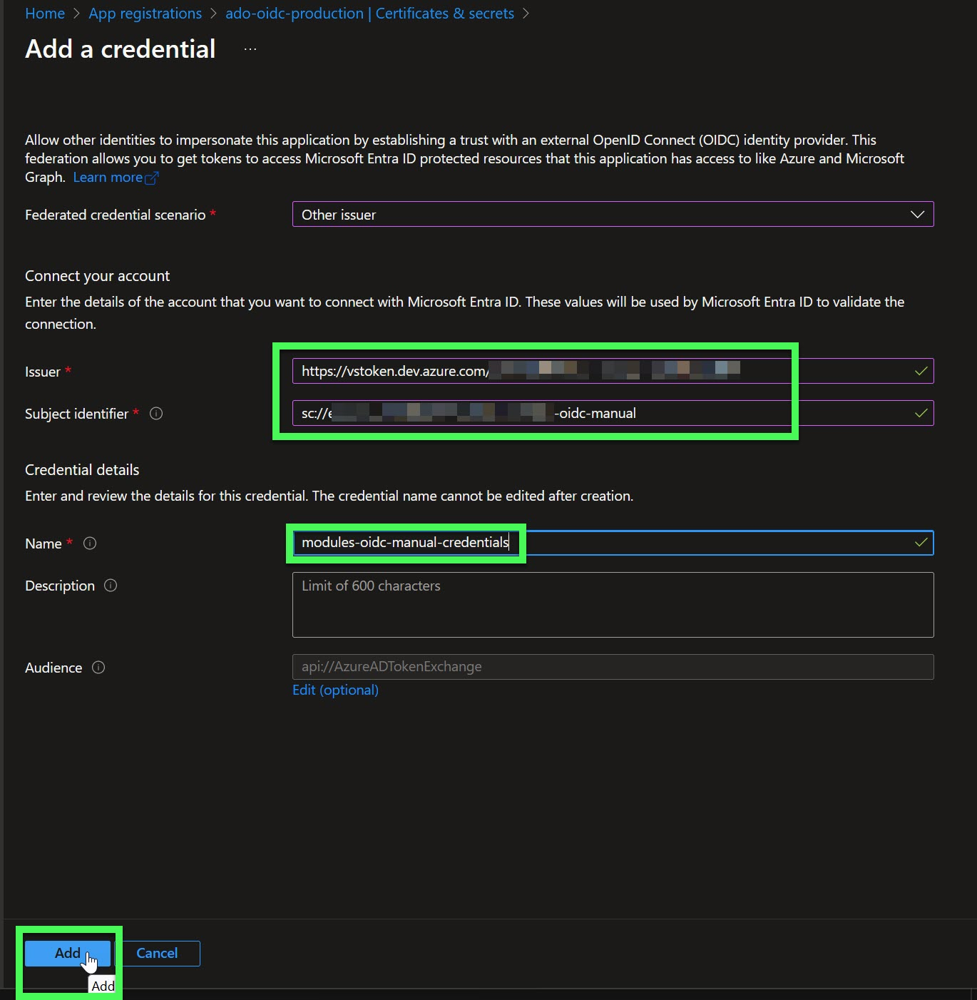
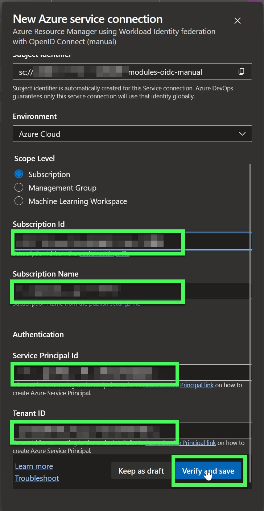
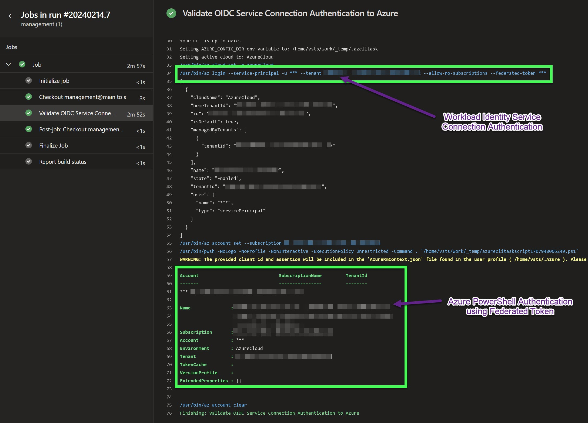

# Connect DevOps and Azure using OpenID Connect

OpenID Connect (OIDC) enables DevOps Service Connections (or GitHub Actions workflows) to authenticate and access resources inside your Azure tenant. The primary advantage is you no longer have to store Azure credentials as ADO Secrets (or GitHub secrets) in your configuration. This guide will walk you through how to create the necessary Azure identities for authentication, followed by how to create the GitHub secrets and use them in your GitHub Actions workflow.

## What is OpenID Connect?

OpenID Connect is an identity layer built on the OAuth 2.0 protocol. It enables secure authentication and authorization between different systems or applications. With OpenID Connect, users can log in to one application using their credentials from another, often called Single Sign-On (SSO).

OpenID Connect is widely used in various scenarios, including web applications, mobile apps, and APIs. It offers a secure and standardized way to enable seamless authentication and authorization across different systems, providing convenience and enhanced security for users and developers alike.

Using OpenID Connect to log in to Azure from GitHub offers several advantages:

1.  **Single Sign-On (SSO)**: With OpenID Connect, users can authenticate once on GitHub and then seamlessly access Azure resources without needing to enter their credentials again. This improves user experience by eliminating the need for multiple logins.
2.  **Simplified Workflow Automation**: OpenID Connect integration allows GitHub Actions workflows to authenticate with Azure using federated credentials. This enables seamless automation of tasks, such as deploying Azure resources or interacting with Azure services, directly from GitHub workflows.
3.  **Secret Management:** While you still need to create an Azure application registration, you no longer need to create secrets, which you must store in an external system. Secrets also have expiration dates. Instead, you create federated credentials to authenticate.
4.  **Granular Permissions:** When creating the federated credentials, you can authorize specific repositories that can use the identity. You can also limit the use of these credentials based on the environment, branch, pull request, or tag in the repository.

Using OpenID Connect to log in to Azure from GitHub provides a unified authentication experience, enhances security, and improves workflow automation capabilities. It simplifies user management and ensures consistent user identities and permissions across both platforms.

## Create a Service Principal in Azure

The first step in connecting GitHub and Azure using OpenID is to create an Entra ID application and service principal. The Azure CLI or Azure PowerShell are excellent methods to create these resources quickly.

### Azure CLI

For Azure CLI, create the application registration using the `az ad app create` command, specifying the `display-name` for the application. Give the application a descriptive name, such as `ado-oidc-production`. The command outputs an app-id, which is also the client-id. Copy this value to use in the following command.

```
az ad app create --display-name ado-oidc-production

```



Next, create a service principal using the `az ad sp create` command, specifying the `id` using the `appId` value from the previous output.

```
az ad sp create --id '<appId>'

```

### Azure PowerShell

For Azure PowerShell, generate the application registration using the New-AzADApplication cmdlet, setting the DisplayName parameter for the application name. The command outputs an AppId, which is also the ClientId. Copy this value to use in the following command.

```
New-AzADApplication -DisplayName ado-oidc-production

```



Next, create a service principal using the `New-AzADServicePrincipal` cmdlet, specifying the `ApplicationId` parameter with the `AppId` value from the previous output.

```
New-AzADServicePrincipal -ApplicationId '<AppId>'

```

## Manually Create DevOps Service Connection

From Devops, navigate to **Project Settings**, then select the **Service Connections** tab.

Click **New service connection** and select **Azure Resource Manager**, then select **Next**.

Select **Workload Identity Federation (manual)** followed by **Next**.

{:height="100px" width="500px"}

Enter the **Service Connection Name** and optionally add a **Description**, then select **Next**.

Leave this window open as you will need the **Issuer** and **Subject Identifier** from the **_New Service Connection_** blade when completing the next step.
</br>
</br>

## Create Federated Credentials

Next, create federated credentials in the application registration you created in the previously. The federated credentials trust tokens issued by the DevOps Service Connection. When the Service Connection is defined in a pipeline which is executed, a token for authentication is issued and is passed through to the Azure login request to gain access to your tenant.

In a new browser tab, navigate to the Microsoft Entra admin center (https://entra.microsoft.com) and expand the **Identity** menu on the left. From there, expand **Applications**, then select **App registrations**.

{:height="10px" width="250px"}

</br>

In the **App registration** window, select the **All applications** tab, then search for the app registration name created in the previous step. Select the result to view the app registration. Under **Manage**, select **Certificates & secrets in the app registration window**, then select the **Federated credentials** tab.

</br>

{:height="100px" width="500px"}

Select **\+ Add credential** to create a new federated credential to trust the DevOps Service Connection token requests. In the **Add a credential** window, select the dropdown menu for **Federated credential scenario** and select **Other Issuer**.

Continue filling out the information. Enter the **Issuer** and **Subject Identifier** from the Service Connection Browser tab, add a name, and optionally add a description for the federated credential. Click **Add** to create the federated credential.

{:height="100px" width="500px"}

</br>
</br>

## Assign RBAC Role to Service Principal

Apply the necessary role-based access control (RBAC) role to the service principal. This role will define the permissions the service principal has in your Azure tenant. The role can be as granular as you need, such as a contributor role for a specific resource group or a reader role for a specific subscription.

</br>
</br>

## Complete DevOps Service Connection Creation

Next, return to the browser tab containing the new service connection page, complete the form by entering the **Application Registration Client Id** and **Tenant Id** from the previous browser tab, in addition, add the **Subscription Id** and **Subscription Name**, then select **Verify and Save**.

{:height="100px" width="500px"}

## Authenticate with OpenID Connect

DevOps Pipeline is now ready to use OpenID Connect to authenticate to Azure via the Workload Identity Service Connection. The example below shows the [AzureCLI@2](https://learn.microsoft.com/en-us/azure/devops/pipelines/tasks/reference/azure-cli-v2?view=azure-pipelines) task with the service connection to authenticate to Azure. By using the **addSpnToEnvironment** attribute set to `$true` makes available the service principal ID, workload identity federation token, and tenant ID of the Azure endpoint to the tasks execution environment.

```
- task: AzureCLI@2
  displayName: 'Validate OIDC Service Connection Authentication to Azure'
  inputs:
    azureSubscription: modules-oidc-manual
    addSpnToEnvironment: true
    scriptType: pscore
    scriptLocation: inlineScript
    inlineScript: |
      Install-Module -Name Az -Repository PSGallery -Force
      Connect-AzAccount -ApplicationId $ENV:servicePrincipalId -Tenant $ENV:tenantId -FederatedToken $ENV:idToken
      Get-AzContext

```

**_You can use the servicePrincipalId, servicePrincipalKey or idToken, and tenantId variables in your script._**

To verify a successful login, view a pipeline run after it has been executed. Find the az cli login step in the top half of the following image. The second highlight validates the use of the federated token made available to the task during runtime.

{:height="100px" width="500px"}
