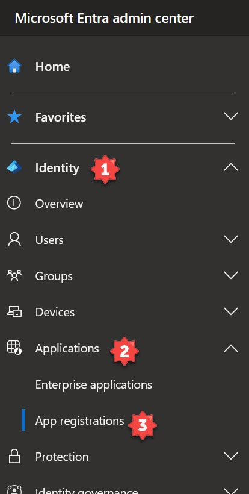

# Connect DevOps and Azure using OpenID Connect

OpenID Connect (OIDC) enables DevOps Service Connections (or GitHub Actions workflows) to authenticate and access resources inside your Azure tenant. The primary advantage is you no longer have to store Azure credentials as ADO Secrets (or GitHub secrets) in your configuration. This guide will walk you through how to create the necessary Azure identities for authentication, followed by how to create the GitHub secrets and use them in your GitHub Actions workflow.

## What is OpenID Connect?

OpenID Connect is an identity layer built on the OAuth 2.0 protocol. It enables secure authentication and authorization between different systems or applications. With OpenID Connect, users can log in to one application using their credentials from another, often called Single Sign-On (SSO).

OpenID Connect is widely used in various scenarios, including web applications, mobile apps, and APIs. It offers a secure and standardized way to enable seamless authentication and authorization across different systems, providing convenience and enhanced security for users and developers alike.

Using OpenID Connect to log in to Azure from GitHub offers several advantages:

1.  **Single Sign-On (SSO)**: With OpenID Connect, users can authenticate once on GitHub and then seamlessly access Azure resources without needing to enter their credentials again. This improves user experience by eliminating the need for multiple logins.
2.  **Simplified Workflow Automation**: OpenID Connect integration allows GitHub Actions workflows to authenticate with Azure using federated credentials. This enables seamless automation of tasks, such as deploying Azure resources or interacting with Azure services, directly from GitHub workflows.
3.  **Secret Management:** While you still need to create an Azure application registration, you no longer need to create secrets, which you must store in an external system. Secrets also have expiration dates. Instead, you create federated credentials to authenticate.
4.  **Granular Permissions:** When creating the federated credentials, you can authorize specific repositories that can use the identity. You can also limit the use of these credentials based on the environment, branch, pull request, or tag in the repository.

Using OpenID Connect to log in to Azure from GitHub provides a unified authentication experience, enhances security, and improves workflow automation capabilities. It simplifies user management and ensures consistent user identities and permissions across both platforms.

## Create a Service Principal in Azure

The first step in connecting GitHub and Azure using OpenID is to create an Entra ID application and service principal. The Azure CLI or Azure PowerShell are excellent methods to create these resources quickly.

### Azure CLI

For Azure CLI, create the application registration using the `az ad app create` command, specifying the `display-name` for the application. Give the application a descriptive name, such as `ado-oidc-production`. The command outputs an app-id, which is also the client-id. Copy this value to use in the following command.

```
az ad app create --display-name ado-oidc-production

```


Next, create a service principal using the `az ad sp create` command, specifying the `id` using the `appId` value from the previous output.

```
az ad sp create --id '<appId>'

```

### Azure PowerShell

For Azure PowerShell, generate the application registration using the New-AzADApplication cmdlet, setting the DisplayName parameter for the application name. The command outputs an AppId, which is also the ClientId. Copy this value to use in the following command.

```
New-AzADApplication -DisplayName ado-oidc-production

```


Next, create a service principal using the `New-AzADServicePrincipal` cmdlet, specifying the `ApplicationId` parameter with the `AppId` value from the previous output.

```
New-AzADServicePrincipal -ApplicationId '<AppId>'

```

## Manually Create DevOps Service Connection

From Devops, navigate to **Project Settings**, then select the "Service Connections\*\* tab.

Click **New service connection** and select **Azure Resource Manager**.

)

Choose the **Service Principal (manual)** authentication method and enter the **Subscription ID**, **Subscription Name**, **Service Principal ID**, and **Service Principal Key**. Click **Verify connection** to ensure the service connection is successful.

## Create Federated Credentials

Next, create federated credentials in the application registration you created in the previous step. The federated credentials trust tokens issued by GitHub Actions. The GitHub Actions workflow requests a token for authentication and uses the Azure login action to gain access to your tenant.

Navigate to the Microsoft Entra admin center (https://entra.microsoft.com) and expand the **Identity** menu on the left. From there, expand **Applications**, then select **App registrations**.



</br>

In the **App registration** window, select the **All applications** tab, then search for the app registration name created in the previous step. Select the result to view the app registration. Under **Manage**, select **Certificates & secrets in the app registration window**, then select the **Federated credentials** tab.

</br>


Select **\+ Add credential** to create a new federated credential to trust GitHub Actions token requests. In the **Add a credential** window, select the dropdown menu for **Federated credential scenario** and select **GitHub Actions deploying Azure resources**.

Continue filling out the GitHub account information. Enter the **Organization** and **Repository** name associated with the GitHub Actions workflow. Select the **Entity type** to scope the OIDC request from the workflow. Entity type options include **Environment**, **Branch**, **Pull request**, or **Tag**. This example uses **Pull request**.

For **Credential details**, include a **Name** and **Description** of the federated credential. Click **Add** to create the federated credential.


Example federated credentials associated with pull requests in a GitHub repository

Continue adding federated credentials for each GitHub Action workflow you are creating. You will use the example above for a pull request workflow, but you can also create a federated credential for GitHub environments, repository branches, or tags.

## Create GitHub Secrets

Next, you need to create GitHub secrets with the application registration and federated credentials. The GitHub secrets contain the **Client ID**, **Tenant ID**, and **Subscription ID** of the application registration, and GitHub uses these for the login action inside the workflow.

**Note:** The application registration’s Client ID is the same as the Application ID. The Azure CLI and Azure PowerShell methods displayed this value when you created them earlier in this guide. If you need these values again, return to the application registration in the Azure portal and view the **Client ID** and **Directory (tenant) ID** in the **Overview** section.


Viewing application registration Client and Tenant ID

Next, navigate to your GitHub account and repository. In the repository, select **Settings** at the top.


Under **Security**, expand **Secret and variables in the Settings page**, then select **Actions**.


On the **Secret** tab, select **New repository secret**. On the **New secret** page, enter the secret’s **Name** followed by the **Secret** value.

The table below shows what you should name each secret and its value. Replace the secret value with the actual values from your environment. Save each secret by clicking **Add secret**.

| GitHub Secret Name    | Secret Value      |
| --------------------- | ----------------- |
| AZURE_CLIENT_ID       | <Client ID>       |
| AZURE_TENANT_ID       | <Tenant ID>       |
| AZURE_SUBSCRIPTION_ID | <Subscription ID> |


Complete secrets list

## Authenticate with OpenID Connect

GitHub Actions workflow is now ready to use OpenID Connect to authenticate to Azure. The example below shows the [Azure login action](https://github.com/marketplace/actions/azure-login) with Azure CLI to authenticate to Azure. The secrets you created in the previous step are referenced in the login action’s `client-id`, `tenant-id`, and `subscription-id` values.

```
- name: az cli login
  uses: azure/login@v1
  with:
    client-id: ${{ secrets.AZURE_CLIENT_ID }}
    tenant-id: ${{ secrets.AZURE_TENANT_ID }}
    subscription-id: ${{ secrets.AZURE_SUBSCRIPTION_ID }}

```

To verify a successful login, view a workflow run after it has been executed. Find the az cli login step and look for the Login successful message. If you expand the step’s first line, the **client-id**, **tenant-id**, and **subscription-id** values are obfuscated as the workflow retrieves these secret values from the repository settings.


Viewing a successful login using OpenID Connect and Azure

## Summary of GitHub and Azure with OpenID Connect

Using OpenID Connect with GitHub and Azure provides a seamless and more secure configuration to deploy and manage Azure. You will no longer need to manage secrets that expire and can use granular permissions to limit when GitHub requests an authentication token.

**Reference:**  
[Microsoft Learn: Use GitHub Actions to connect to Azure](https://learn.microsoft.com/azure/developer/github/connect-from-azure)  
[GitHub: Configuring OpenID Connect in Azure](https://docs.github.com/actions/deployment/security-hardening-your-deployments/configuring-openid-connect-in-azure)

Check out more of my Git and GitHub-related articles **[here](https://jeffbrown.tech/category/git/)**!

## Post navigation
